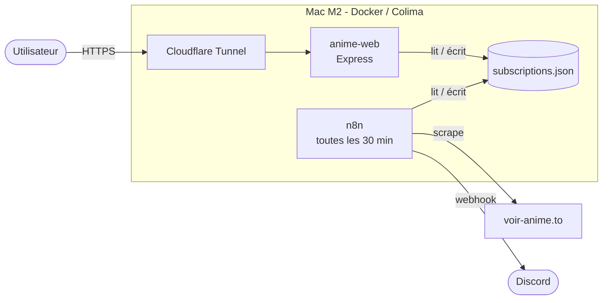

# Anime Notif

> Notifications Discord automatiques à la sortie d'un nouvel épisode d'anime.

Anime Notif surveille les pages d'animes de [voir-anime.to](https://voir-anime.to)
et envoie un message Discord dès qu'un nouvel épisode est publié. Une interface
web permet de gérer la liste des animes suivis sans toucher au serveur.

## Sommaire

- [Architecture](#architecture)
- [Démarrage rapide](#démarrage-rapide)
- [Configuration](#configuration)
- [Exploitation](#exploitation)

## Architecture



**Composants**

| Service | Rôle | Port |
|---|---|---|
| `anime-web` | API Express + interface de gestion des abonnements | 3000 |
| `n8n` | Orchestration du scraping et de l'envoi des notifications | 5678 |
| `cloudflared` | Expose l'interface web sur Internet | — |

**État applicatif** — `subscriptions.json` est l'unique source de vérité :
liste des animes suivis, webhook de destination et dernier épisode connu.
Il est monté en volume et n'est jamais versionné (voir [Configuration](#configuration)).

## Démarrage rapide

### Prérequis

- Docker et Docker Compose
- Un webhook Discord ([comment en créer un](https://support.discord.com/hc/fr/articles/228383668))

### Installation

```bash
git clone git@github.com:<ton-user>/anime-notif.git
cd anime-notif

cp .env.example .env                                   # puis renseigne les valeurs
cp subscriptions.example.json data/subscriptions.json  # état initial

docker compose -f deploy/docker-compose.yml up -d
```

L'interface est disponible sur `http://localhost:3000`.

## Configuration

Toute la configuration passe par des variables d'environnement, décrites dans
[`.env.example`](.env.example). Le fichier `.env` contient des secrets et
**n'est jamais versionné**.

| Fichier | Contenu | Versionné |
|---|---|---|
| `.env` | Secrets et configuration locale | ❌ |
| `.env.example` | Documentation des variables, sans valeurs | ✅ |
| `data/subscriptions.json` | État applicatif (abonnements, épisodes vus) | ❌ |
| `subscriptions.example.json` | Format attendu | ✅ |

## Exploitation

```bash
docker compose -f deploy/docker-compose.yml ps        # état des services
docker compose -f deploy/docker-compose.yml logs -f   # logs en continu
docker compose -f deploy/docker-compose.yml restart   # redémarrage
```

## Structure de subscriptions.json:

| Champ | Type | Description |
|---|---|---|
| `anime_name` | string | Nom affiché dans la notification |
| `anime_url` | string | URL de la page de l'anime sur voir-anime.to |
| `discord_webhook` | string | Salon de destination des notifications |
| `last_episode` | number | Dernier épisode notifié. `0` = tout notifier |


## Licence

Usage personnel.
